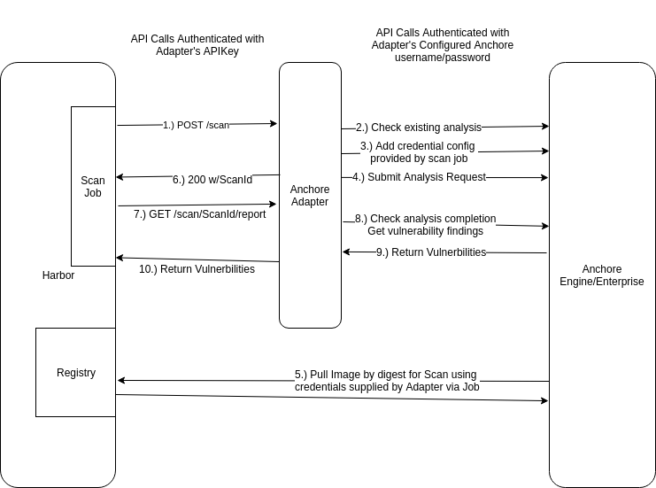
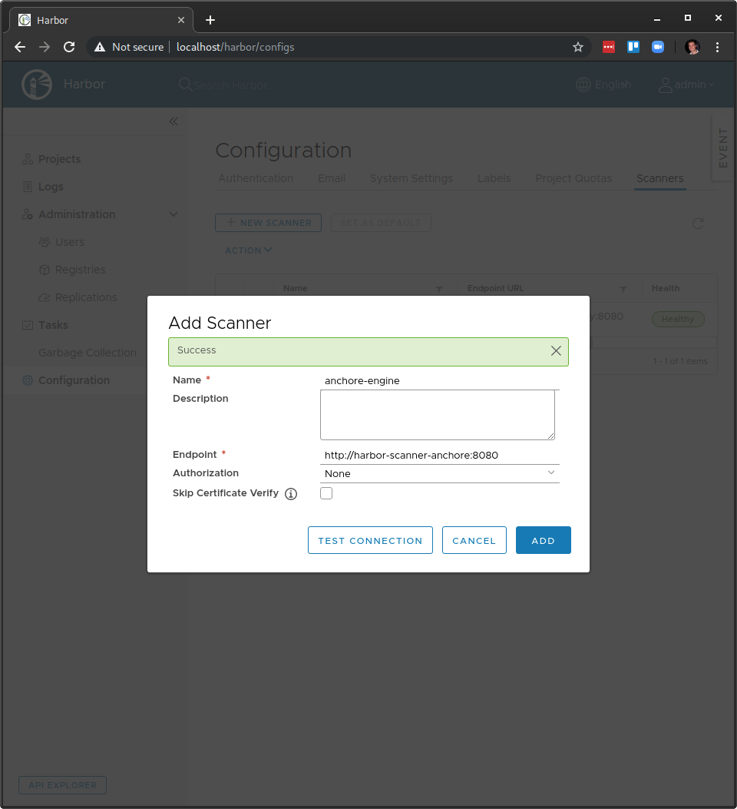

[![CI][ci-img]][ci]
[![Go Reportcard][report-card-img]][report-card]

# Harbor Scanner Adapter for Anchore Engine/Enterprise

## Overview

The Harbor Scanner Adapter for Anchore is a service that translates the Harbor scanning API into the Anchore API
and allows Harbor to utilize Anchore Enterprise for providing vulnerability reports on images stored in Harbor as
part of its vulnerability scan feature.

This Adapter is only required if you want Harbor to use Anchore for its 'Scan' feature. If your objective is to use Anchore in a CI/CD
workflow or to provide its own analysis reports against images stored in Harbor, that can be achieved without this Adapter.




### Authentication

#### Harbor-to-Adapter

API requests between Harbor and the adapter should be protected by TLS/HTTPS at the channel level, but can also use a shared secret for authentication.
See the configuration section below on setting an API key for the Adapter. Then, when adding the adapter to Harbor via the UI, use the 'Bearer' auth type
and set the value to the value set in the adapter configuration. This will cause harbor to send they token as a Bearer token to the adapter, which will verify
the HTTP Authorization header against the expected value.

#### Adapter-To-Anchore

API calls between the Adapter and Anchore should also be protected by TLS/HTTPS and also require a username/password for HTTP Basic authentication to Anchore. For this, it 
is highly recommended to create a specific harbor user in Anchore and use those credentials in the auth secret presented to the Adapter as described below in the configuration section.

Note that these are not credentials use to pull images from Harbor, only to authenticate API calls between the adapter service and the Anchore API service.

#### Anchore-To-Harbor

API requests from Anchore services to Harbor to fetch the image data for analysis are protected by short-lived credentials generated by Harbor and passed to the Adapter service on each
new scan request. The Adapter service automatically configures Anchore to use the supplied credentials for the data fetch operations as part of requesting an image analysis to Anchore.

The adapter never makes requests to Harbor and never reads any image content, only Anchore services access any Harbor image data.

## Building the Adapter service

Run `make` to run test and get the binary in dist/<platform>/anchore-adapter
```
make
```

To build into a container: 
```
make snapshot
```


## Configuration

Configuration of the adapter is done via environment variables at startup or via a configuration file. If both are used,
environment variable values take precedent over values from the file.

### Environment Variables

Adapter configuration values. These cannot be set in the client config file, only via environment variables.

| Environment Variable | Description | Default Value |
|----------|-------------|---------------|
| SCANNER_ADAPTER_LISTEN_ADDR | The address for the adapter to listen on for HTTP traffice | ":8080" |
| SCANNER_ADAPTER_LOG_LEVEL | Log verbosity | "info" |
| SCANNER_ADAPTER_LOG_FORMAT | Format of the log, either text or json | "text" |
| SCANNER_ADAPTER_APIKEY | Secret that must be presented by client (harbor) to authenticate calls to the adapter itself | null |
| SCANNER_ADAPTER_FULL_VULN_DESCRIPTIONS | Add full vulnerability descriptions, but will make scans slower | true |
| SCANNER_ADAPTER_TLS_KEY_FILE | Path to the private key for the API to listen with HTTPS | null |
| SCANNER_ADAPTER_TLS_CERT_FILE | Path to the public cert file for the API to listen with HTTPS | null |
| SCANNER_ADAPTER_FILTER_VENDOR_IGNORED | If set, any vulnerabilities marked as ignored or will-not-fix by vendor (e.g. Debian's No-DSA flag will not be returned in the scan result. This can help reduce noise in scans if you accept the distro vendor's fix assessment. | False |
| SCANNER_ADAPTER_REGISTRY_VALIDATE_CREDS | If set, the adapter will ask Anchore to validate the credentials passed to it by Harbor for the image fetch. If false, then the validation is skipped and credentials are used without being checked first. | True |
| SCANNER_ADAPTER_REGISTRY_TLS_VERIFY | If set to False, the adapter will set a flag in Anchore to ensure Anchore skips validation of the TLS certificate when it contacts Harbor to pull the image. This is primarily for use when your Harbor install uses self-signed certificates | True |
| SCANNER_ADAPTER_DESCRIPTION_CACHE_ENABLED | Boolean to enable a vulnerability cache to improve performance of the scan by caching vulnerability descriptions | True |
| SCANNER_ADAPTER_DESCRIPTION_CACHE_COUNT | Number of cache entries to keep in memory in the adapter. This is the number of description strings to cache | 10000 | 
| SCANNER_ADAPTER_DESCRIPTION_CACHE_TTL | The timeout value for entries in the description cache. Descriptions can be updated, so larger values give better performance but may have stale descriptions. | 86400 (24 hours) |
| SCANNER_ADAPTER_REPORT_CACHE_ENABLED | Boolean to enable caching of the raw vulnerability reports from Anchore within the Adapter. This reduces the call volume to Anchore for different report types requested by Harbor or scans that are close-together and result in the same report from Anchore between Anchore's vuln db updates | True |
| SCANNER_ADAPTER_REPORT_CACHE_COUNT |  The number of raw Anchore image vulnerability reports to cache in memory to avoid repeated calls to Anchore for the same result. | 100 |
| SCANNER_ADAPTER_REPORT_CACHE_TTL | The ttl, in seconds, for raw Anchore vulnerability reports in the adapter, which are re-used for the Harbor format and raw format responses. A good value here is at least 10 seconds. | 180 |
| SCANNER_ADAPTER_DB_UPDATE_CACHE_ENABLED | Boolean to enable caching of the Anchore vulnerability db updated timestamp to reduce call volume between the adapter and Anchore. Harbor tends to check the update timestamp often so this reduces calls to Anchore. | True |
| SCANNER_ADAPTER_DB_UPDATE_CACHE_TTL | The number of seconds to keep the last db update timestamp before checking the Anchore service again. The service check to Anchore is a bit resource intensive so this value helps reduce load on Anchore from the Adapter | 60 | 
| ANCHORE_ENDPOINT | The url to reach the Anchore API (e.g https://anchore.mydomain.com) | null |
| ANCHORE_USERNAME | The username the Adapter will use to authenticate API calls against Anchore itself. This must be a username within Anchore, not a Harbor user. | null | 
| ANCHORE_PASSWORD | The password the Adapter will use to authenticate API calls against Anchore itself. This is not a Harbor credential. | null |
| ANCHORE_CLIENT_TIMEOUT_SECONDS | Timeout (in seconds) for API calls to Anchore from the Adapter | 60 |
| ANCHORE_AUTHFILE_PATH | A path to a json file with any of the properties "username", "password", "endpoint", "timeoutseconds", and "tlsverify" to enable passing Anchore credentials to the Adapter without environment variables (e.g. for secrets in k8s mounted as a file) | null |
  

### Configuration file format

The configuration file must be json formatted and may contain all or some of the below fields. The config file is loaded first, and any values also present in the environment will override the file values.

```
{
  "username": "harbor",
  "password": "harboruserpass123",
  "endpoint": "http://somehost",
  "timeoutseconds": 60,
  "tlsverify": false
} 
```

## Deployment

### Requirements

This adapter requires an Anchore Engine or Enterprise deployment to operate against. The adapter can be deployed before the anchore installation,
but the endpoint url and credentials must be known to pass to the adapter.

It is highly recommended to create a new account in the anchore deployment and a new user with credentials dedicated to the Harbor adapter.


### Kubernetes

Install Harbor:

```
helm install --name harbor harbor/harbor
```

Install Anchore Enterprise:

```
helm install --name anchore stable/anchore-engine -f enterprise_values.yaml
```

Create a harbor account and user in Anchore for the adapter to use for authenticating calls to Anchore. 

_This is not required, but recommended as it will limit the scope of the adapter's credentials within Anchore to a 
non-admin account and keep all Harbor image data in one account for easy management. This step can be skipped for demo environments where the Anchore Engine deployment is not shared, but is strongly encouraged for all production use and all cases where
Harbor will be integrated with an existing Anchore deployment._

```
ANCHORE_CLI_USER=admin
ANCHORE_CLI_PASS=$(kubectl get secret --namespace default anchore-anchore-engine -o jsonpath="{.data.ANCHORE_ADMIN_PASSWORD}" | base64 --decode; echo)
ANCHORE_CLI_URL=http://anchore-anchore-engine-api.default.svc.cluster.local:8228/v1/
kubectl run -i --tty anchore-cli --restart=Always --image anchore/engine-cli  --env ANCHORE_CLI_USER=admin --env ANCHORE_CLI_PASS=${ANCHORE_CLI_PASS} --env ANCHORE_CLI_URL=http://anchore-anchore-engine-api.default.svc.cluster.local:8228/v1/
```

In the anchore-cli container running inside the cluster, now create a new account in Anchore, _harbor_ with a single user _harbor_ and password for this example (use a much stronger password in your install)

```
anchore-cli account add harbor
anchore-cli account user add --account harbor harbor harboruserpass123

```

Install the adapter:

If you created a custom user:
```
kubectl create secret generic anchore-creds --from-literal=username=harbor --from-literal=password=harboruserpass123
```

To use the default admin user/pass for a fresh test/dev install of anchore (DO NOT DO THIS FOR PRODUCTION!):
```
kubectl create secret generic anchore-creds --from-literal=username=admin --from-literal=password=foobar
```

Install the adapter:
```
kubectl apply -f ./k8s/harbor-adapter-anchore.yaml
```

Configure the scanner in Harbor:

In the Harbor UI login as an admin and navigate to Configuration>Scanners and click "+ New Scanner".



In 'Endpoint', type: "http://harbor-scanner-anchore:8080"

Leave authorization empty since in this example we did not set an API key in the adapter deployment environment.

Click "Test Connection" and should work. 
You can now click "Add" to complete the setup.

## Special Thanks

Special thanks to the following for their help with the prototype adapter implementation that inspired this work:

* [cafeliker](https://github.com/cafeliker)
* [MaGaoJU](http://github.com/MaGaoJu)

[ci]: https://circleci.com/gh/anchore/harbor-scanner-adapter/tree/master
[ci-img]: https://circleci.com/gh/anchore/harbor-scanner-adapter/tree/master.svg
[report-card]: https://goreportcard.com/report/github.com/anchore/harbor-scanner-adapter
[report-card-img]: https://goreportcard.com/badge/github.com/anchore/harbor-scanner-adapter
